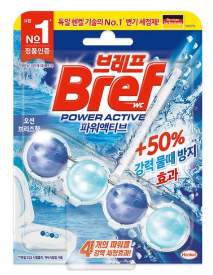
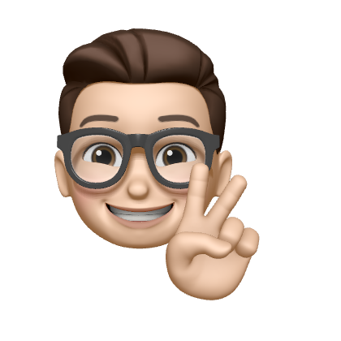

# HTML & CSS
## 240205 
## HTML 기본태그 

``` txt 

h : 글제목 
p : 본문 
button : 버튼 태그 
a : 링크 태그 / href : 링크 입력
ul, li : 리스트 태그
img : 이미지 태그 
src 이미지 경로 // alt : 이미지를 보여줄수 없을때 텍스트로 대처

```

## Tag 이용 
```html

 <h1>글 제목</h1>
    <p>본문</p>
    <button>버튼 태그</button>
    <!-- 링크  -->
    <a href="https://google.com">링크</a>
   
    <!-- 리스트 -->
   <ul>
    <li>항목1</li>
    <li>항목2</li>
   </ul>
    <!-- src: 이미지 경로 // alt : 이미지를 보여줄수 없을때 텍스트로 대처-->
    
    <h2>랑크로 이미지 대처</h2>
   <!-- 링크를 이미지로 대처 -->
    <a href="https://google.com">
        
    </a>

```
## 과제1 : 글자 일부를 누르면 이동
``` html
<h2>
    과제 입니다. 
    <a href="https://naver.com">
        이동하기
    </a>
</h2>

```

## 기본적인 웹페이즈 스타일링

```txt

이미지 가운데 정렬 : display: block; margin-left: auto; margin-right: auto
font 사이즈 vw :  현재 브라우저 창의 너비 // %: 내 부모태그의 사이즈에 비례
자간 사이즈 : letter-spacing
font 가운데 정렬 : font-align : center

글자 굵기 : font-weight or stong

```

```html 
 <!-- 이미지 가운데 정렬 : display: block; margin-left: auto; margin-right: auto -->
    

    <!-- font 사이즈 vw :  현재 브라우저 창의 너비 // %: 내 부모태그의 사이즈에 비례 -->
    <!-- 자간 사이즈 : letter-spacing-->
    <!-- font 가운데 정렬 : font-align : center -->
    <h3 style="letter-spacing: 5px; text-align: center;">LION</h3>
    <!-- 일부 글자만 스타일링 -->
    <!-- span : 아무 의미 없는 태그 -->
    <!-- 글자 굵기 : font-weight or stong -->
    <p>
        <span style="color: red; font-weight:600;">King</span> of the safari</p>

    <!-- 과제2 : 본인 프로필 페이지 제작 -->
    
    <h3 style="text-align: center; letter-spacing: 5px; font-size: 2.5vw;">MinJun</h3>

```

## 과제2 : 자기 프로필 만들기 


```html
 
    <h3 style="text-align: center; letter-spacing: 5px; font-size: 2.5vw;">MinJun</h3>

    <p style="text-align: center; font-size: 200%;">
        <span style="color: red; font-weight: bolder;">
            Front-end
        </span>
         Developer
    </p>
```
## CSS 만들고 첨부

```txt 

CSS의 우선 순위 

html 안의 style> id > class > tag

```
## Tag 우선순위

```txt

.이름 : 클래스 선언
태그 : 해당 태그에 전부 적용
# : id 선언

```

## html에 css 선언

```html

<head>
    <!-- CSS 폴더 -->
    <link rel="stylesheet" href="../css/main.css" rel="stylesheet">
</head>

```

## CSS 파일 작성
```css
/* class 선언 */
/* class 특징  1. 점 찍고 작명, 2. 이름 중복 피하기*/
.profile{
    display: block; 
    margin-left: auto;
    margin-right: auto; 
}
.name{
    text-align: center; 
    letter-spacing: 5px; 
    font-size: 2.5vw;
}
.content{
    color: blueviolet;
}
/* 모든 p태그에 밑에 CSS 작용 */
p{
    text-align: center; 
    font-size: 200%;
    color: blue;
}

/* id선언 - 별로 안씀 */
#special{
    text-align: center; 
    font-size: 200%;
    color: chartreuse;
}

```

## 240206
## div 박스 만들기 

```txt 

margin : 상하좌우 여백 
padding : 상하좌우 안쪽 여백
border : 테두리
border-radius : 테두리 둥글게

가운데 정렬 
display: block;
margin-left: auto;
margin-right: auto;

box-shadow : 그림자 효과 

```
그림자 참고 URL : https://codingbroker.tistory.com/65 


```html 

 <div class="box">박스 추가</div>

```

```css


.box{
    text-align: center;
    background-color: aqua;
    width: 200px;
    
    /* 상하좌우 여백 */
    margin :10px;
    /* 상하좌우 안쪽 여백 */
    padding: 40px;
 
    border-radius: 15px;

    /* 가운데 정렬 */
    display: block;
    margin-left: auto;
    margin-right: auto;
    font-size: 30px;

    /* 숙제3 - 박스에 그림자 효과 */
    box-shadow: 10px 10px 0 0 ;
}

```
## 레이아웃 float 만들기 1

> 이부분은 하기의 이미지를 만들기 위한 것


```html

<!DOCTYPE html>
<html lang="en">
<head>
    <meta charset="UTF-8">
    <meta name="viewport" content="width=device-width, initial-scale=1.0">
    <link rel="stylesheet" href="../css/layout.css">
    <title>레이아웃</title>
</head>
<body>
    <div class="container">
        <div class="header"></div>
        <div class="left-menu"></div>
        <div class="right-menu"></div>
        <div class="footer"></div>
    </div>    
</body>
</html>

```

### css 설명

```txt

요소를 왼쪽정렬 (공중에 띄어져 있는것) > float: left
float:left하는 이유 : div는 기본적으로 display:black이 되어있기에 한행을 전부 차지

float 해결방안(공중에 띄어져 있는것의 해결방안)
clear:both;

```

```css 

.container{
    width: 800px;
}

.header{
    /* 부모태그 width의 100% */
    width: 100%;
    height: 100px;
    background-color: aquamarine;
}
/* float:left하는 이유 : div는 기본적으로 display:black이 되어있기에 한행을 전부 차지 */
.left-menu{
    width: 20%;
    height: 400px;
    background-color: blue;
    /* 요소를 왼쪽정렬 (공중에 띄어져 있는것) */
    float: left;
}
.right-menu{
    width: 80%;
    height: 400px;
    background-color: cadetblue;
    /* 요소를 왼쪽정렬 (공중에 띄어져 있는것)*/
    float: left;
}
.footer{
    width: 100%;
    height: 100px;
    background-color: brown;
    /* float 해결방안 */
    clear:both;
}

```
## 레이아웃 inline-block 만들기 

> 공부한걸 정리를 하겠지만 안쓰는것이 좋다. 불편

``` txt
display: inline-block; - 내 크기만큼 차지하게 해주세요
inline-block 사용 시 공백을 삭제 해주어야 한다.

```

```html
 <div class="container">
        <div class="header"></div>
        <!-- css에서 display: inline-block;를 사용시 공백을 없애야 한다. -->
        <div class="left-menu"></div><div class="right-menu"></div>
        <div class="footer"></div>
    </div>  
```

```css

.container{
    width: 800px;
}

.header{
    /* 부모태그 width의 100% */
    width: 100%;
    height: 100px;
    background-color: aquamarine;
}
.left-menu{
    width: 20%;
    height: 400px;
    background-color: blue;
    /* display: inline-block; - 내 크기만큼 차지하게 해주세요 */
    display: inline-block;
}
.right-menu{
    width: 80%;
    height: 400px;
    background-color: cadetblue;
    display: inline-block;
}
.footer{
    width: 100%;
    height: 100px;
    background-color: brown;
}

```

## 레이아웃 과제 

> 하기와 같은 레이아웃을 만들어야 한다.


```txt

 그러기 위해선 구획을 먼저 나누어 주고 시작

 1. 본문과 사진이 들어갈 자리를 background-color로 표시
 2. 본문에서 사진, 이름, 시간을 작성
 3. 본문 작성
 4. 이미지 추가 

순으로 하면 된다.  
이때 미세 margin 및 padding도 들어간다. 
```

> 하기의 사진은 본인이 만들것 (헤더는 그냥 넣어봄)

 

```html

<!DOCTYPE html>
<html lang="en">
<head>
    <meta charset="UTF-8">
    <meta name="viewport" content="width=device-width, initial-scale=1.0">
    <link rel="stylesheet" href="../css/layoutHomeWork.css">
    <title>레이아웃 과제</title>
</head>
<body>
    <div class="container">
        <div class="header">
            <p style="padding: 2px;">레이아웃 첫번째 과제</p>
        </div>
        <div class="content">
            
            <div class="blog-name">
                <h4 style="margin: 8px;">최민준</h4>
                <p style="margin: 8px;">1시간전</p>
            </div>
            <div class="blog-content">
                <h4 style="margin: 10px;">더러운 화장실 변기엔 역시 Bref!!!!</div>
                <p style="margin: 10px;"> 더러운 화장실 변기 청소떄문에 고생하시는 당신을 위한 아이템! 독일 변기 세정제 Bref!!!!</p>
            </div>
        </div>
        <div class="blog-img">
            
        </div>
    </div>
</body>
</html>

```

```css 

.container{
    width: 800px;
}
.header{
    width: 100%;
    height: 50px;
    text-align: center;
    border-style:solid;
}
.content{
    width: 70%;
    height: 300px;
    float: left;
    clear: both;
}
.blog-name{
    float: left;
}
.blog-content{
    clear: both;
}
.blog-img{
    width: 20%;
    height: 300px;
    float: left;
    background-color: pink;

}
.size{
    width: 100%;
}

```
## Nav 만들기 

```txt

1. nav라는 태그 생성
   nav도 div랑 같지만 nav라고 알기 위해서 사용

2. nav css 생성
navbar li는 모두 아래의 css를 적용
navbar>li는 직계 자손만 적용 


```

```html

 <!-- nav도 div랑 같지만 nav라고 알기 위해서 사용 -->
    <nav>
        <ul class="navbar">
            <li><a href="#">영화</a></li>
            <li><a href="#">맛집</a></li>
            <li><a href="#">IT</a></li>
            <li><a href="#">PC</a></li>
        </ul>
    </nav>


```

```css

/* navbar li는 모두 아래의 css를 적용 */
.navbar li{
    display: inline-block;
    width: 60px;
    text-align: center;
    background-color: #eee;
    padding: 15px;
    border-radius: 10px;
  
}
.navbar a{
    font-size: 16px;
    /* a태그 밑줄 제거 */
    text-decoration: none;
    /* 방문 후 표시색 변경*/
}
a:visited {
    color : green;
}
a:hover {
    color : red;
}

/* 만약에 space가 아닌 >를 사용시 직계 자식에만 적용 */
/* 직계자식 예시 */
/* 

.navbar>li{
    display: inline-block;
}

*/

```
